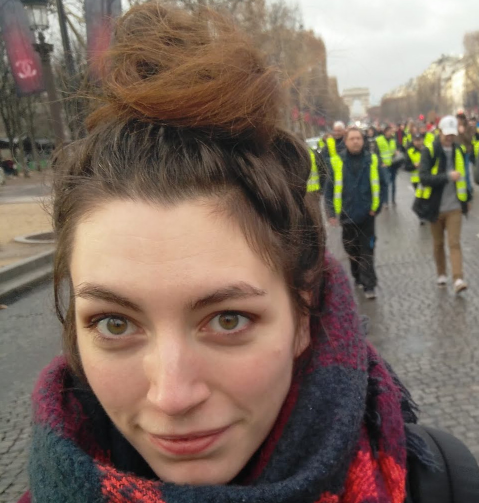
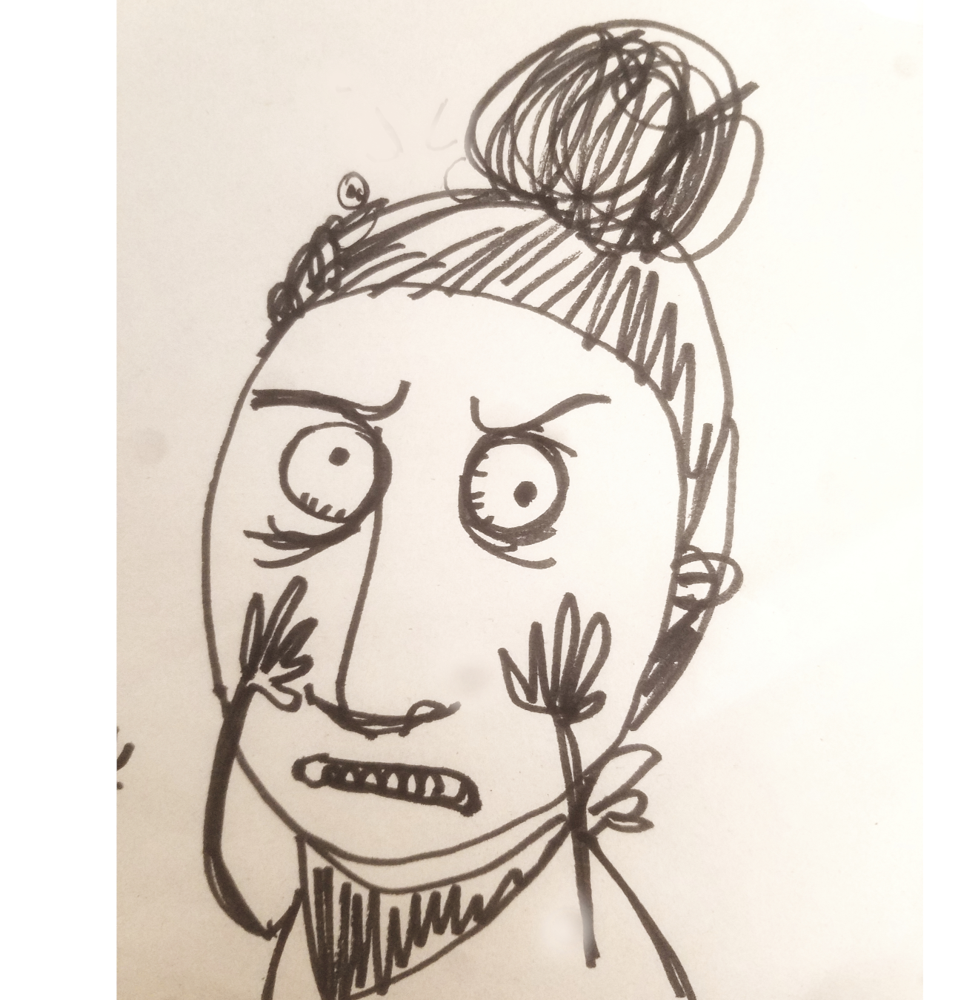
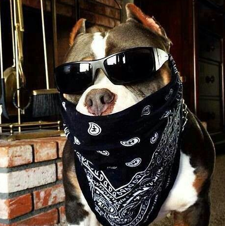

{: style="text-align: justify" }
I am a Flatiron Research Fellow at the Center for Computational Astrophysics, Simons Foundation, NY (joined in July 2018). Before that, I did my PhD in Computer Science and Machine Learning at Sorbonne Universite in Paris, France.

{: style="text-align: justify" }
I work at the intersection between **Machine Learning, Data Mining, and Astrophysics/Astronomy**. I develop Machine Learning and Data Mining tools that aim to provide new insights on data, to help deepen our understanding and potentially discover unknown or unexplained properties of the data and their underlying physics. Most recently, I have spent time working on **finding and characterizing gaps** in datasets, inspired by Topological Data Analysis. I am also interested in **representation learning** methods for tasks such as class-discovery, anomaly detection, and one-class classification, applied on complex data such as time-series or graphs/sets. I also spend time thinking about interpretability and understandability of Machine/Deep Learning methods for scientific discovery.

I actually look like this: 

More likely like that when things no work

I share some fashion style with the dog 

You can find my Google Scholar list of publications [here](https://scholar.google.com/citations?user=zUNlxp4AAAAJ&hl=en%). 

